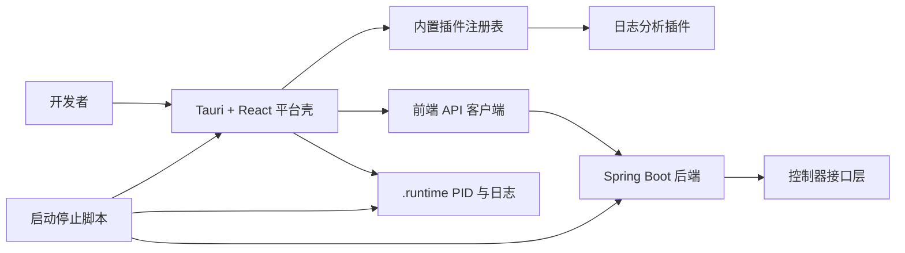

# ForgeDesk 架构说明

## 产品定位

ForgeDesk 是一个面向研发工作流的桌面插件平台。

- 平台层负责导航、插件激活、运行容器和共享状态。
- 插件层承载具体业务能力，例如日志分析、JSON 工具、环境入口和排查记录。
- Java 后端当前保持轻量，负责桌面端 API，并为后续持久化、本地集成和自动化能力预留承载点。

## 模块概览

### `apps/desktop`

前端平台壳，基于 `Tauri 2 + React + Vite + TypeScript`。

- `src/App.tsx`
  平台总壳、侧边栏、插件切换、后端状态管理。
- `src/platform-home.tsx`
  平台首页和插件总览卡片。
- `src/plugins/index.tsx`
  内置插件注册表，也是当前插件激活入口。
- `src/plugins/log-inspector.tsx`
  第一个可运行的插件示例。
- `src/api.ts`
  前端 API 客户端，负责健康检查和平台初始化数据请求。
- `src/types.ts`
  平台和插件共享的类型契约，例如 `PluginDefinition` 和 `PluginContext`。

### `apps/backend`

后端服务，基于 `Spring Boot 3.4 + Java 21 + Maven`。

- `app.forgedesk.ForgeDeskApplication`
  Spring Boot 启动入口。
- `app.forgedesk.api.HealthController`
  运行时健康检查接口。
- `app.forgedesk.api.WelcomeController`
  为前端平台壳提供轻量初始化数据。
- `app.forgedesk.config.CorsConfig`
  本地开发阶段的跨域配置。

### `scripts`

本地运行辅助脚本。

- `scripts/start.sh`
  后台启动前后端，并管理 PID 和日志文件。
- `scripts/stop.sh`
  优先优雅停止，必要时强制清理。
- `scripts/dev.sh`
  兼容入口，当前转发到 `start.sh`。

## 依赖链路



## 运行模型

### 平台层职责

- 负责应用总壳和导航。
- 负责插件加载和激活。
- 向插件提供共享上下文。
- 管理后端连接状态。
- 后续承载命令面板、权限和插件设置。

### 插件层职责

- 渲染插件自己的交互界面。
- 处理插件局部状态和操作流程。
- 消费平台下发的共享上下文。
- 通过平台认可的客户端模块调用后端能力。

### 后端职责

- 对桌面端暴露安全可控的 HTTP API。
- 为后续本地文件访问、解析任务、持久化和工作流自动化提供落点。
- 在需要本地系统访问或持久状态时，把复杂逻辑从前端插件中抽离出来。

## 当前激活模型

ForgeDesk 当前采用内置插件注册模式。

- 插件在构建时和桌面应用一起打包。
- 通过首页插件卡片或侧边栏条目激活插件。
- 插件契约定义在 `apps/desktop/src/types.ts`。

这样做是有意保持简单，先验证插件交互和平台边界，再决定是否引入可安装外部插件。

## 演进方向

### 第一阶段

- 稳定平台壳。
- 补充更多内置插件。
- 引入共享存储和插件级设置。

### 第二阶段

- 增加命令面板驱动的插件激活。
- 增加插件元数据清单文件。
- 把插件注册从硬编码数组迁移到清单加载器。

### 第三阶段

- 支持可安装插件包。
- 增加插件权限模型。
- 在后端增加插件服务钩子，承接更重的本地能力。

## 目录草图

```text
forgedesk
├── apps
│   ├── backend
│   │   └── src/main/java/app/forgedesk
│   └── desktop
│       └── src
│           ├── plugins
│           ├── App.tsx
│           ├── api.ts
│           ├── platform-home.tsx
│           └── types.ts
├── docs
│   ├── architecture.md
│   └── run-and-deploy.md
└── scripts
    ├── start.sh
    ├── stop.sh
    └── dev.sh
```
