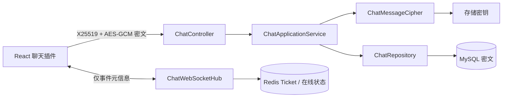

# 聊天模块架构说明

## 定位

ForgeDesk 聊天是服务端中心化分发系统。服务端负责鉴权、会话、消息持久化、在线状态与实时通知；浏览器只持有当前页面会话的临时传输私钥。消息正文不会以明文通过 REST 或 WebSocket 传输，也不会以明文保存在数据库。



后端依赖遵循 `interfaces -> application -> domain`，基础设施实现领域端口。Controller 仅处理 DTO 和身份注解，不包含鉴权或加密业务规则。

## 加密流程

1. 服务进程启动时生成 X25519 传输密钥对，并暴露公钥。
2. 浏览器载入聊天插件时生成仅存于内存的 X25519 私钥，用服务端公钥协商共享密钥。
3. 浏览器用 AES-256-GCM 加密正文，并将 `ciphertext`、`nonce`、临时公钥发给服务端。
4. 服务端解密传输密文后，用 `FORGEDESK_CHAT_STORAGE_KEY` 派生的 AES-256-GCM 密钥加密后写入 MySQL。
5. 成员读取消息时，服务端解开存储密文，并按本次浏览器的临时公钥重新加密响应。
6. WebSocket 仅通知会话 ID、发送者和时间；客户端再按 `after` 游标读取新增密文。

这将一次群消息的服务端工作固定为一次解密、一次存储加密和一次事件广播，不再按群成员或用户设备重复创建加密信封。

## 安全边界

- 服务端可在内存中短暂处理正文以完成中心化分发；它不是端到端加密。
- MySQL 中只保存存储密文和 nonce，不保存正文。
- 浏览器临时私钥不会上传，也不会落盘；服务重启或页面刷新会重新协商。
- REST 传输密文能阻止被动链路监听直接读取消息。使用公网 HTTP 时，服务端公钥仍无法被浏览器认证，存在主动中间人风险，生产部署应使用 HTTPS 或通过可信渠道固定并校验公钥指纹。
- 服务端必须设置高熵 `FORGEDESK_CHAT_STORAGE_KEY`；未设置时仅允许本地开发回退，生产部署不应依赖回退值。

## 运行与数据

| 数据                                           | 存放位置                             |
| ---------------------------------------------- | ------------------------------------ |
| 用户、会话、消息存储密文、头像、笔记、翻译配置 | MySQL                                |
| 登录会话、一次性 WebSocket Ticket、在线状态    | Redis                                |
| 浏览器传输私钥与阅读游标                       | 内存与浏览器本地存储                 |
| `FORGEDESK_CHAT_STORAGE_KEY`                   | 服务端受限环境变量或非 Git 的 `.env` |

部署环境至少配置：

```env
FORGEDESK_CHAT_STORAGE_KEY=<使用密码管理器生成的高熵随机值>
```

旧 P2P 模式的设备密钥、群密钥相关代码已不再参与业务流程。数据库中已有的 `keyVersion=1` 历史密文不会自动删除，但中心化模式不会读取或展示它，避免在未经确认的情况下销毁旧数据。

## 实时同步与分页

- Socket Ticket 有效期为一分钟且只能使用一次，Token 不放入 WebSocket URL。
- `ChatWebSocketHub` 按用户维护活跃连接数量，首个连接上线、最后一个连接离线时才广播状态变化。
- 收到 `message-created` 后，当前会话按时间游标拉取增量；不是当前会话时只刷新未读数量和会话排序。
- REST 每页最多 100 条。初次读取是最近一页，向上滚动使用 `before`，实时使用 `after`。

## 当前限制

- 不提供消息撤回、编辑、服务端已读回执、离线推送或文件消息。
- 会话成员当前创建后不可调整；群名称和公告仅群主可修改。
- 服务端传输密钥当前随服务进程重启而轮换，已打开的浏览器页面需要刷新以重新建立加密通道。
