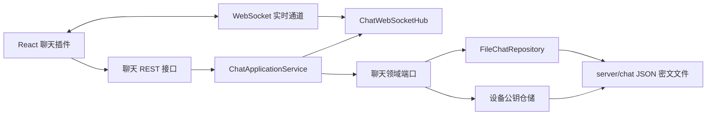

# 加密聊天架构说明

## 范围与结论

ForgeDesk 聊天是一个依赖 ForgeDesk 服务进行身份、会话目录、密文持久化和实时通知的端到端加密聊天模块。服务端**会参与消息同步和在线状态维护**，但不保存或处理消息明文、设备私钥和消息 AES 密钥。

因此，它不是“完全不经过服务器”的 P2P 聊天；服务端承担密文中继与存储。端到端加密的边界是：只有拥有对应设备私钥的成员设备可以读取消息正文。

## 架构与职责



| 层级         | 位置                                | 职责                                                        |
| ------------ | ----------------------------------- | ----------------------------------------------------------- |
| 前端         | `apps/desktop/src/plugins/chat.tsx` | 会话、消息和 WebSocket UI；只在本机加密/解密                |
| 前端密码模块 | `apps/desktop/src/chat-crypto.ts`   | 生成和保存设备密钥；AES-GCM 加密；RSA-OAEP 封装消息或群密钥 |
| 接口层       | `interfaces/rest/chat`              | HTTP DTO、`@RequireLogin` 鉴权、当前身份传递                |
| 应用层       | `application/chat`                  | 成员校验、创建/删除会话、发送密文、密钥信封迁移             |
| 领域层       | `domain/chat`                       | 会话、密文消息、设备公钥与仓储端口                          |
| 基础设施     | `infrastructure/chat`               | JSON 持久化、一次性 Socket Ticket、WebSocket 在线状态与通知 |

后端依赖方向遵循 `interfaces -> application -> domain`，基础设施只实现领域端口。Controller 不读取或写入聊天文件。

## 加密模型

1. 每个浏览器设备在本机 IndexedDB 中生成一对 RSA-OAEP 密钥；私钥不会上传。
2. 设备向服务端登记 `deviceId` 和 RSA 公钥 JWK，供会话成员发送消息时查询。相同设备与相同公钥的重复登记是无写入、无广播操作。
3. 一对一会话为每条消息随机生成 AES-GCM 密钥和 nonce，再使用双方全部已登记设备的 RSA 公钥封装该消息密钥。
4. 群聊首次发送前创建一个随机 AES-GCM 群会话密钥，并仅在初始化或新增设备时为设备生成 RSA-OAEP 信封。服务端只保存这些信封，不保存群密钥明文。
5. 后续群消息只使用群会话密钥加密一次正文，消息 `keyEnvelopes` 为空并携带 `keyVersion`；服务端校验群密钥信封已覆盖所有成员设备后持久化密文。
6. 接收端仅用自己 IndexedDB 中的 RSA 私钥解开所需信封，再用 AES 密钥解密正文。

群聊的单条消息不再随成员设备数线性膨胀：从“每条消息生成 N 个 RSA 信封”变为“每条消息一次 AES 加密，设备变化时才生成新增设备的信封”。设备公钥在客户端按用户缓存；设备变更只通知共享会话的成员并使该用户缓存失效。

服务端可见的信息包括：用户 ID、会话成员、设备公钥、消息密文、nonce、发送时间和设备密钥信封。服务端不可见消息正文和任意设备私钥。

## 实时同步与在线状态

- REST 登录令牌不会放进 WebSocket URL。客户端先请求一次性 Socket Ticket，Ticket 有效期为 1 分钟且只能消费一次。
- WebSocket 成功连接后，`ChatWebSocketHub` 按用户维护活跃 session 数。首个连接发送上线事件，最后一个连接断开才发送离线事件。
- 新会话、消息与信封补齐触发 `conversation-changed`，新设备或公钥变更触发带 `userId` 的 `device-changed`。设备变更只通知该用户共享会话的成员。已知会话收到消息事件时只更新本地排序；当前打开的会话使用时间游标拉取新增密文，不再刷新会话列表或下载整段历史。若页面存在暂时不可解密的历史密文，则合并多个信封更新后只重读一次当前页。
- 删除会话触发 `conversation-deleted`，所有在线成员立即移除列表项；离线成员下次拉取会话列表时也不会再得到该会话。

WebSocket 的 `signal` 消息仅为后续点对点协商预留，当前消息正文同步不依赖它。

## 新设备历史同步

新设备只有自己的私钥，无法直接解开历史消息中为旧设备封装的密钥。已登录的旧设备会读取能解密的历史消息，为新设备的公钥补充对应 AES 密钥信封，再上传信封。过程中不会上传消息明文或旧设备私钥。

这项迁移必须在至少一台已有可解密历史的设备在线时完成；如果所有旧设备的私钥都丢失，历史密文无法恢复。

## 会话删除语义

- 删除是**全体删除**，不是“只从我的列表隐藏”。
- 仅 `createdBy`（会话创建者）可以调用删除接口；其他成员没有删除入口且服务端会拒绝请求。
- 删除会移除会话元数据和该会话的服务端消息密文文件，不能恢复。
- 已经缓存在其他设备内存中的明文不会被远程抹除；客户端会在收到实时事件后清空当前消息视图。

当前版本没有“退出会话”“只对我隐藏”“撤回单条消息”能力；这些能力需要额外的数据模型和独立接口，不应复用全体删除接口。

## 本地数据位置

运行数据位于 `~/.forgedesk`。当前环境将其映射到项目内的 `.forgedesk/`，因此聊天数据实际位于：

```text
.forgedesk/server/chat/
├── conversations.json
├── group-keys.json
└── messages/<conversation-id>.json
.forgedesk/server/users/<user-id>/
└── chat-devices.json
```

这些文件包含会话成员、密文和设备公钥，不得提交到 Git。设备私钥保存在浏览器 IndexedDB，不在上述目录中。

## 已知限制

- 不提供消息撤回、编辑、已读回执、离线推送或文件消息。
- JSON 文件仓储适合本地单机伴随服务，不适合多实例并发部署。消息 REST 返回值按 100 条分页，但文件仓储仍需读取对应 JSON 文件；超大规模历史应迁移到带索引的数据库实现。
- 会话删除涉及两个文件写入步骤；异常时可能遗留无引用的密文文件，但不会在会话列表中暴露。后续可引入事务数据库或清理任务。
- 成员列表创建后不可修改，避免在未重新封装历史消息密钥的情况下改变访问范围。群成员变更需要轮换群会话密钥与重新分发设备信封，当前版本不支持。
